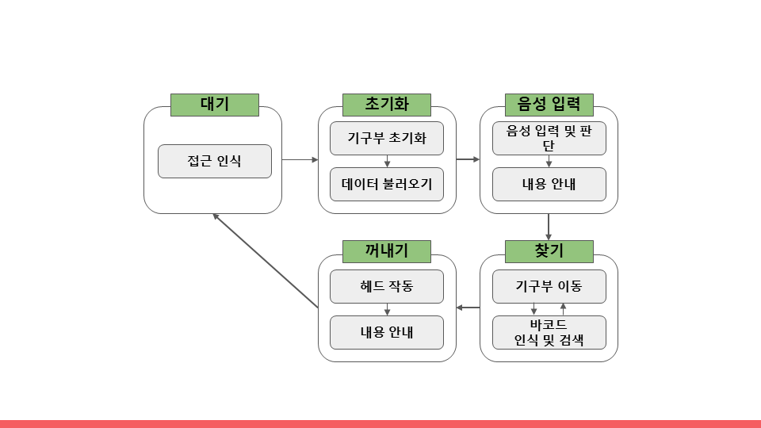
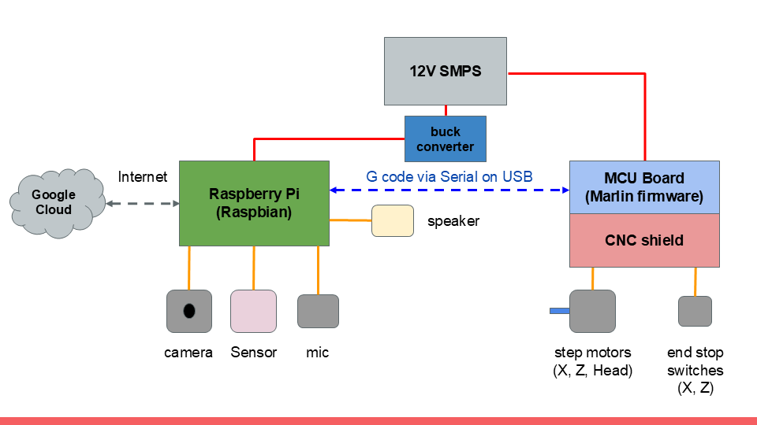
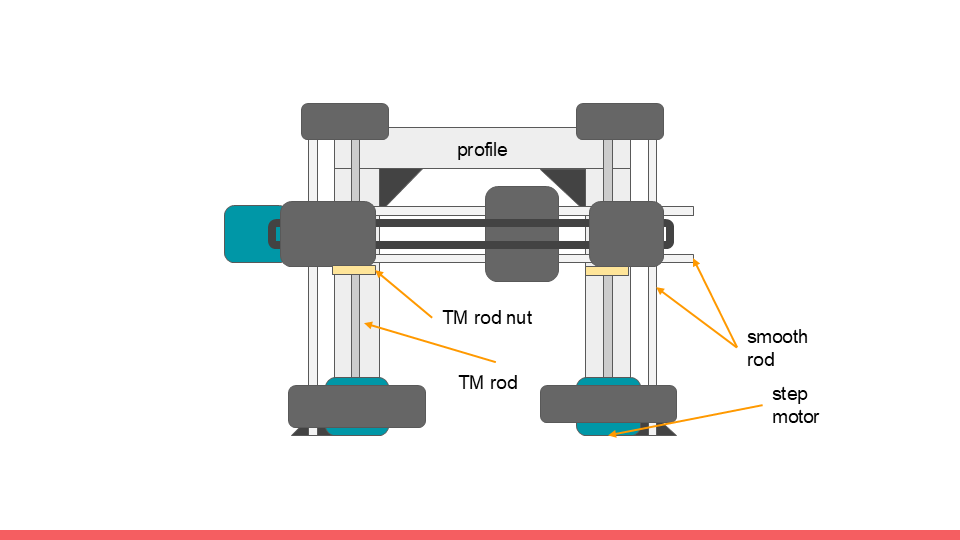

# 스마트 알약 선별 디스펜서
2022년 숭실대학교 교내 캡스톤 경진대회 출품작

## 간단한 작품 설명 
상비약을 자동으로 선별하고 제공해주는 가정용 스마트 선반

### 1. 개발동기
저희는 시각장애인 유튜버 분의 영상을 통해서 의약품을 오용하는 일이 생활에서 자주 일어나는 불편이라는 사실을 접했습니다. 이를 해결할 수 있는 장치를 고민하다 상비약을 자동으로 선별하고 제공까지 해주는 가정용 가전을 만들면 이 불편함을 해결할 수 있을 것이라 생각하였습니다. 저희의 아이디어를 구체적으로 구성하였고, 이를 실제 장치로 만드는 프로젝트를 추진하였습니다. 저희 팀이 제작한 ‘스마트 알약 선별 디스펜서’ 가 적용된 선반에 의약품을 보관하면, 자신이 원하는 의약품을 음성인식을 통해 장치가 직접 찾아 꺼내어 손쉽게 이용할 수 있습니다. 이는 의약품 오용을 막을 수도 있습니다.

### 2. SW 작동 방식

5가지의 각 상태로 구성되어 있습니다. 각 과정에서 내부적으로도 상태를 가지며, 주어진 조건을 달성하면 다음 상태로 넘어갑니다.

### 3. HW 구성

해당 장치는 메인보드, 기구부, 클라우드 세 부분으로 구성되어있습니다.
메인보드가 전체 제어를, 기구부가 실제 움직임을 담당합니다.
구글 API를 이용한 음성 인식, 데이터베이스 접근에 클라우드가 사용됩니다.

라즈베리 파이 및 ARDUINO MEGA 2560 + RAMPS 구성입니다. MARLIN 펌웨어를 사용하여 구동되며, 각 기구부의 연결을 위한 부품은 ANET A8 파츠를 사용하여 구성하였습니다.

### 4. 한계
바코드 인식을 활용하기에는 카메라 및 OPEN CV 장비가 고가이다보니 비전 처리를 이용해서 바코드 뿐만 아니라 글자나 이미지를 인식하는 등 점자가 없는 제품에 대한 다양한 솔루션을 만들고 싶었으나, 추가적인 개발이 부진했습니다.

또한, 기계의 크기, 칸 개수, 데이터 시트 등등 config를 개별의 파일로 적는 방법을 사용하고 싶었는데 지나치게 하드코딩된 감이 있는 것 같습니다.

빠른 아이디어 구현에 힘쓰다 보니 완성도가 떨어집니다...

#### 기타 및 소감
예전에 했던 자료를 올려 놓은거라 git이 반영되지 않았는데, 결과물을 잃어버리지 않기 위해서 업로드 해봅니다... 

뭣도 모르고 소프트웨어 지식도 없는데, 어떻게든 구현을 위해서 힘쓴 결과물이 이렇게 나온것 같습니다. 머리에 있는 다양한 오픈 소스, 그리고 파이썬 모듈을 덕지덕지 붙여서 구현해봤고, 덕분에 파이썬이라는 언어와 친해진 것 같습니다. 